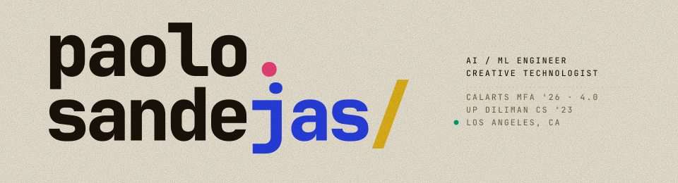
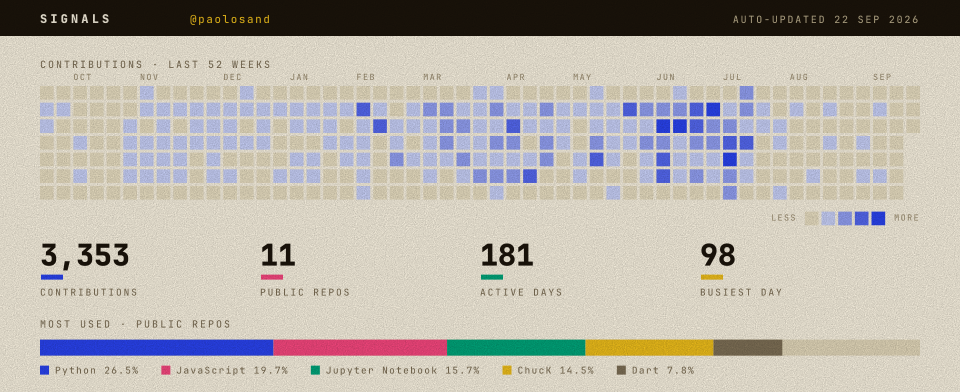

<picture>
  <source media="(prefers-color-scheme: dark)" srcset="./assets/banner-dark.svg">
  
</picture>

### ◆ FEATURED

| Project | Stack | What it is |
|---|---|---|
| **[CHULOOPA](https://github.com/paolosand/CHULOOPA)** | `ChucK` `PyTorch` `OSC` | Real-time AI drum looper — a 4.8M-param Transformer variation engine + personalized KNN beatbox classifier, MIDI → Ableton, live. *MFA thesis.* |
| **[tabIt](https://github.com/paolosand/tabIt)** | `TypeScript` `React` `FastAPI` `MV3` | Turns any YouTube song into a synced, play-along chord sheet — GPU source separation and a chord model reconciled against an isolated bass stem to emit real slash chords. ~36s cold analysis. |
| **[ASCII Drone Synth](https://paolosand.github.io/ascii_drone/)** | `MediaPipe` `Tone.js` `Three.js` `GLSL` | Gesture-controlled web synth — hand tracking at 30fps drives 4-voice synthesis; WebGL ASCII rendering via GPU-instanced shaders. |

`+ more` — [HAI · Head as Interface](https://www.youtube.com/watch?v=rxaJTSi7KDY) (wearable ultrasonic instrument), multi-modal video pipelines, production AI tooling, and AI×music installations → **[full portfolio](https://paolosandejas-portfolio.vercel.app/)**

### ◆ STACK

**Languages**

**AI / ML**

**APIs & Agents**

**Full-Stack**

**Creative Tech**

### ◆ SIGNALS

<picture>
  <source media="(prefers-color-scheme: dark)" srcset="./assets/signals-dark.svg">
  
</picture>

Regenerated daily from the GitHub API by [`update-signals.yml`](./.github/workflows/update-signals.yml) — no hand-typed numbers.

### ◆ ELSEWHERE

